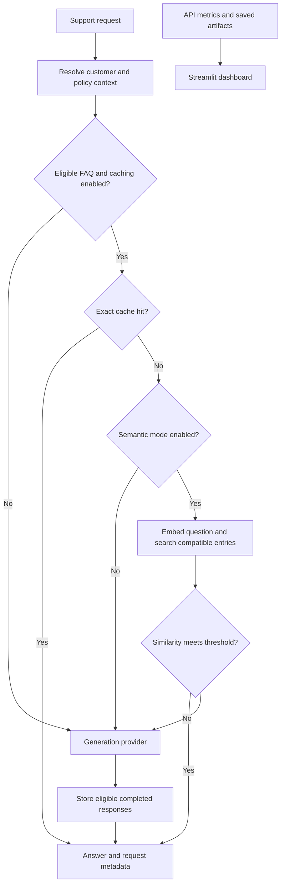

<div align="center">

# Cachewise

**An LLM caching lab built around an ecommerce support assistant.**

Measure response reuse, inspect latency and token usage, and evaluate semantic cache quality.


[Get started](#getting-started) · [Caching](#response-caching) · [Dashboard](#dashboard) · [Evaluation](#evaluation) · [Development](#development)

</div>

## Overview

Repeated support questions are a useful setting for exploring LLM caching: some answers can be shared, while others depend on a customer's orders, region, or membership tier. Cachewise makes those boundaries explicit and provides the tools to measure what happens when responses are reused.

The project combines a FastAPI assistant, fictional ecommerce data, Redis exact and semantic caches, reproducible replay traffic, and a read-only Streamlit dashboard. Generation, embedding, and judge providers are configured independently through OpenAI-compatible endpoints.

> **Status:** The assistant, cache modes, replay comparison, saved-hit judging, and dashboard are implemented. Semantic threshold approval and the final held-out quality gate are still pending. Caching is disabled by default; no validated speedup or dollar-savings claim is made.

## What you can explore

| Capability | What it does |
| --- | --- |
| Context-aware support | Resolves customer profiles, versioned policies, and customer-owned orders |
| Exact caching | Reuses completed FAQ responses when the question and generation context match |
| Semantic caching | Searches compatible FAQ entries by embedding similarity after an exact miss |
| Cache invalidation | Advances policy or catalogue namespaces without flushing Redis |
| Replay experiments | Compares uncached, exact, and semantic modes on seeded traffic |
| Answer review | Judges saved semantic hits and exports cases for manual review |
| Observability | Reports cache outcomes, usage, latency, and reproducibility evidence |

## Architecture



A response-cache hit avoids generation. vLLM prefix caching is separate: it can reuse prompt computation when generation still happens. Metrics keep these two mechanisms distinct.

## Getting started

### Prerequisites

- Python **3.12** and **uv**.
- An OpenAI-compatible generation endpoint, or the bundled local vLLM setup.
- Docker for the supplied Redis service when enabling response caching.
- For bundled local serving: Linux, an NVIDIA GPU with CUDA support, and access to PyPI and Hugging Face.

### 1. Install

```bash
git clone https://github.com/Djalal-H/llm_cache.git
cd llm_cache
uv python install 3.12
uv sync --frozen
cp .env.example .env
```

The API and CLI read `.env`; exported environment variables take precedence. Keep credentials in your local `.env`, which is gitignored.

### 2. Configure generation

**Use an existing provider** by setting these values in `.env`:

```dotenv
CACHEWISE_GENERATION_BASE_URL=https://your-provider.example/v1
CACHEWISE_GENERATION_MODEL=your-model-name
CACHEWISE_GENERATION_API_KEY=your-api-key
```

**Or run the bundled local model** in a separate terminal:

```bash
bash scripts/setup_vllm.sh
mkdir -p artifacts/diagnostics
.venv-vllm/bin/python scripts/serve_vllm.py 2>&1 | tee artifacts/diagnostics/vllm-startup.log
```

The launcher serves `Qwen/Qwen2.5-3B-Instruct-GPTQ-Int4` as `cachewise-model` at `http://127.0.0.1:8001/v1`, matching `.env.example`. It uses a separate environment pinned to vLLM 0.29.0, FP16 compute, a 2,048-token context, one concurrent sequence, and prefix caching.

The hardware target is an RTX 3060 Laptop GPU with 6 GB VRAM. Readiness depends on available GPU memory; the launcher has no CPU fallback. Model revisions and serving settings are recorded in `artifacts/serving.json`, which records a startup attempt rather than proving readiness.

### 3. Start the API

```bash
uv run --frozen uvicorn cachewise.api:app --host 127.0.0.1 --port 8000
```

In another terminal:

```bash
curl --fail http://127.0.0.1:8000/health

curl --fail http://127.0.0.1:8000/chat \
  -H 'Content-Type: application/json' \
  -d '{"customer_id":"demo-alice","question":"What is the return policy?","language":"en"}'
```

Explore the interactive API at **[localhost:8000/docs](http://127.0.0.1:8000/docs)**.

### 4. Try response reuse

```bash
docker compose up -d redis
```

Set `CACHEWISE_CACHE_MODE=exact` in `.env` and restart the API. Send the FAQ above twice. With an empty cache and a completed generation, expect `miss` followed by `exact_hit`.

Then ask `Where is my order?` to exercise the personalized path, which bypasses response caching.

## Support API

| Endpoint | Purpose |
| --- | --- |
| `POST /chat` | Generate or reuse a support answer |
| `GET /health` | Inspect provider, fixture, and cache readiness |
| `GET /metrics` | Read process-local usage, latency, and cache counters as JSON |
| `POST /admin/invalidate` | Advance cache namespaces using an admin bearer token |
| `GET /docs` | Browse the interactive API schema |

Chat requests accept `customer_id`, `question`, optional `language` (default `en`), and optional `history`: a list of `{ "role": "user" | "assistant", "content": "..." }` objects.

| Customer | Tier | Region |
| --- | --- | --- |
| `demo-alice` | Standard | US |
| `demo-bob` | Premium | US |
| `demo-claire` | Standard | EU |
| `demo-dan` | Premium | EU |

Profiles are resolved on the server. Personalized prompts include only orders owned by the selected customer, while shared FAQ prompts omit customer identifiers and order data. All fixtures are fictional; selecting a customer ID is a demo identity mechanism, not production authentication.

Responses include an answer, request ID, cache outcome, token usage, model, prompt hashes, and policy/catalogue versions. Semantic hits also include similarity and source identity. The `X-Request-ID` header correlates errors: unknown customers return 404, invalid input 422, provider failures 502, and provider timeouts 504.

## Response caching

| Mode | Request path | Dependencies |
| --- | --- | --- |
| `disabled` | Generate every answer | Generation provider |
| `exact` | Exact lookup → generate on miss | Generation provider + Redis |
| `semantic` | Exact lookup → semantic lookup → generate on miss | Generation provider + Redis vector search + embeddings |

### Cache boundaries

The conservative router recognizes supported English FAQ wording about returns, shipping, and payments. Personal orders, charges and refunds, live stock, mixed requests, conversation history, and unrecognized wording bypass caching. Requested response language is independent and forms part of the cache identity.

Exact identity includes the normalized question, prepared prompt, server-resolved tier and region, language, generation settings, model identity, and fixture/cache versions. Normalization preserves case, punctuation, numbers, and negation. Update `CACHEWISE_GENERATION_MODEL_REVISION` when weights or chat templates change behind the same model name.

Only nonempty responses ending with `finish_reason: "stop"` are stored. Hits do not refresh the default 24-hour TTL. Redis and embedding failures preserve the generation path. Concurrent misses can generate more than once; stampede suppression is not implemented.

### Exact mode

```dotenv
CACHEWISE_CACHE_MODE=exact
CACHEWISE_REDIS_URL=redis://127.0.0.1:6379/0
CACHEWISE_CACHE_TTL_SECONDS=86400
CACHEWISE_CACHE_TIMEOUT_SECONDS=1
CACHEWISE_ADMIN_TOKEN=replace-with-your-local-admin-token
```

Restart the API after changing settings. To invalidate cached responses, use your configured token:

```bash
curl --fail http://127.0.0.1:8000/admin/invalidate \
  -H 'Authorization: Bearer <admin-token>' \
  -H 'Content-Type: application/json' \
  -d '{"scope":"all"}'
```

Supported scopes are `policy`, `catalogue`, and `all`. Invalidation changes namespaces, leaving old entries to expire naturally; it does not edit fixture facts. In-flight generations retain their captured namespace. A blank admin token disables the endpoint.

Run the live exact-cache check against an otherwise idle instance:

```bash
uv run --frozen python scripts/smoke_exact_cache.py
```

The script reads `.env`, invalidates namespaces, repeats a FAQ, and invalidates again. It expects `miss → exact_hit → miss`, two generation calls, and one avoided call. It uses the live provider and changes the instance's cache namespaces.

### Semantic mode

Configure an embedding provider and its actual output dimension:

```dotenv
CACHEWISE_CACHE_MODE=semantic
CACHEWISE_EMBEDDING_BASE_URL=https://your-embedding-provider.example/v1
CACHEWISE_EMBEDDING_MODEL=your-embedding-model
CACHEWISE_EMBEDDING_API_KEY=your-api-key
CACHEWISE_EMBEDDING_DIMENSION=768
CACHEWISE_SEMANTIC_THRESHOLD=0.95
```

The dimension and threshold above are examples. Thresholds must be between **0.80 and 0.99**; there is no default or approved threshold. Change `CACHEWISE_EMBEDDING_MODEL_REVISION` when embedding behavior changes behind the same model name.

The supplied Redis 8.2 service supports the FLOAT32 FLAT cosine index. Search filters context and expiration before nearest-neighbor selection. Context includes the prompt excluding the question, generation settings, profile, language, and versions. Additional filters separate negations, numbers, destinations, and common policy conditions.

Semantic reuse requires similarity at or above the threshold. Hits do not create new entries or refresh TTLs. Embedding failures still allow exact-cache writes, and unavailable vector search leaves exact caching and generation usable. No judge runs in the chat path. These filters reduce coverage but do not prove semantic correctness.

## Dashboard

```bash
uv run --frozen streamlit run src/cachewise/dashboard.py \
  --server.address=127.0.0.1 --browser.gatherUsageStats=false
```

Open **[localhost:8501](http://127.0.0.1:8501)** and select **Refresh** to inspect:

- Exact and semantic hits, bypasses, avoided generation calls, and token usage.
- p50/p95 latency and active cache versions.
- Saved replay tables, mode comparisons, and judge evidence.
- Reproducibility metadata and downloadable manifests/comparison CSVs.

Saved evidence remains available when the API is offline. Native Streamlit reads `CACHEWISE_DASHBOARD_API_URL` and `CACHEWISE_DASHBOARD_ARTIFACTS_DIR` from exported environment variables, not `.env`; defaults are `http://127.0.0.1:8000` and `artifacts`.

Live counters cover one API process since startup. Latency uses the last 10,000 requests, including failures, and hit rates use all requests. Missing token usage is reported as unavailable rather than zero.

## Evaluation

### Record a baseline

```bash
uv run --frozen cachewise dataset --seed 42

CACHEWISE_CACHE_MODE=disabled uv run --frozen cachewise replay \
  --limit 10 --output artifacts/baseline-smoke
```

The API must also have caching disabled. Without `--allow-cache`, replay rejects enabled caching before warm-up. Runs are sequential, use two unmeasured warm-up calls by default, and require fresh output directories.

The seeded dataset contains **1,000 requests**, **60% exact repetitions**, and separate **300-request tuning** and **700-request evaluation** splits. Paraphrase families do not cross splits. Repetition is a traffic assumption, not a promised hit rate.

Review the smoke-run answers, restart vLLM for fresh prefix state, then record the full baseline:

```bash
CACHEWISE_CACHE_MODE=disabled uv run --frozen cachewise replay \
  --output artifacts/baseline-full \
  --serving-metadata artifacts/serving.json
```

Omit `--serving-metadata` for other serving setups. When supplied, the manifest must describe the active server.

### Compare the three modes

Set a nonempty admin token for cached runs. For each mode (`disabled`, `exact`, `semantic`), restart the API with that mode, then run the matching replay by changing `MODE` below:

```bash
MODE=exact
CACHEWISE_CACHE_MODE="$MODE" uv run --frozen cachewise replay \
  --allow-cache --split tuning --warmup-count 2 \
  --output "artifacts/tuning-$MODE"
```

API and runner configurations must match. Cached runs invalidate response-cache namespaces **after warm-up**, so use a dedicated instance without other traffic. Restart vLLM before each comparison run and keep serving settings and warm-up counts identical. Replay does not reset engine prefix state.

After all three runs finish:

```bash
uv run --frozen cachewise compare \
  --runs artifacts/tuning-disabled artifacts/tuning-exact artifacts/tuning-semantic \
  --output artifacts/tuning-comparison
```

Comparison rejects failed runs or mismatched traffic, generation settings, serving metadata, and warm-up counts. Negative deltas mean fewer tokens/calls or lower latency than the uncached baseline. Prefix warm-state equivalence remains unverified.

### Review semantic hits

Set `CACHEWISE_JUDGE_BASE_URL`, `CACHEWISE_JUDGE_MODEL`, and credentials when required:

```bash
uv run --frozen cachewise judge-replay \
  --run artifacts/tuning-semantic \
  --output artifacts/tuning-semantic-judged
```

The judge calls a live endpoint and may incur charges. Results include a false-hit numerator/denominator, observed rate, and 95% Wilson interval. Uncertain judgments, missing policy context, and judge errors count as failures. Zero semantic hits means insufficient evidence.

The manual-review queue contains up to 50 cases, prioritizing failures and low similarity. Fewer than 50 leaves the review target unmet. Tune on tuning traffic and reserve held-out traffic for evaluation.

| Experiment | Exported evidence |
| --- | --- |
| Replay | `requests.jsonl`, `aggregate.csv`, `warmup.jsonl`, `manifest.json`, available engine snapshots |
| Comparison | `comparison.csv`, `report.md`, `manifests.json` |
| Judging | `judgments.jsonl`, `summary.json`, `manual-review.csv`, `report.md` |

Failed requests remain in exports, and replay exits nonzero if a measured request fails. Per-request prefix evidence comes only from provider-reported cached prompt tokens; engine snapshots cannot identify individual hits. Dollar savings remain unavailable without a serving-cost model.

## Docker

With a generation provider running and `.env` configured:

```bash
docker compose up --build -d
```

Compose starts the API, dashboard, and persistent Redis service. vLLM runs separately. The supplied configuration uses Linux host networking for application services and image builds, with API/dashboard listeners bound to loopback. Stop native API/dashboard processes to avoid port conflicts. Docker must support and enable host networking.

The dashboard mounts `./artifacts` read-only and receives no provider or admin credentials.

```bash
docker compose down
```

Redis data and local artifacts persist. Stop the separate vLLM process when finished.

## Development

```bash
uv run --frozen pytest -q
uv run --frozen ruff check .
uv run --frozen ruff format --check .
```

Automated tests use deterministic providers and HTTP transports without calling live LLMs. They cover ownership boundaries, prompt identity, routing, provider errors, API validation, replays, evaluation, and dashboard behavior.

To include real Redis integration tests:

```bash
docker run --rm -d --name cachewise-tests -p 127.0.0.1:16379:6379 \
  redis:8.2-alpine redis-server --save '' --appendonly no
CACHEWISE_TEST_REDIS_URL=redis://127.0.0.1:16379/0 uv run --frozen pytest -q
docker stop cachewise-tests
```

Redis integration tests skip when `CACHEWISE_TEST_REDIS_URL` is unset. Live model readiness and semantic quality require separate evaluation.

### Project structure

```text
src/cachewise/
├── api.py              # FastAPI routes and lifecycle
├── assistant.py        # Customer context and prompt preparation
├── chat.py             # Cache routing and generation
├── cache.py            # Exact Redis cache and invalidation
├── semantic.py         # Embeddings and vector lookup
├── eligibility.py      # Conservative FAQ routing
├── providers.py        # Generation, embedding, and judge adapters
├── dataset.py          # Seeded replay traffic
├── replay.py           # Sequential replay and exports
├── evaluation.py       # Saved-hit judging and comparison
├── dashboard.py        # Read-only Streamlit UI
└── data/fixtures.json  # Fictional support data
scripts/                # Local serving setup and live smoke test
serving/                # Pinned vLLM dependencies
tests/                  # Unit and integration tests
```

## Roadmap

- [x] Support assistant with fictional ecommerce fixtures
- [x] Exact and semantic response caching
- [x] Namespace invalidation and graceful cache failure handling
- [x] Replay comparison, saved-hit judging, and dashboard
- [ ] Automated threshold selection and freezing
- [ ] Held-out false-hit gate below 1% and human review ingestion
- [ ] Configured paid-provider cost accounting
- [ ] Dedicated prefix-caching enabled/disabled experiment
